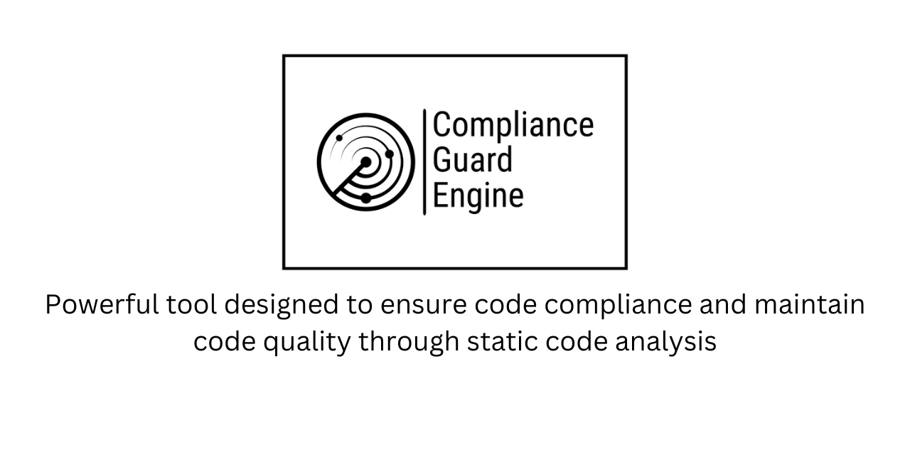

# Compliance Guard Engine

## Overview

ComplianceGuardEngine is a powerful tool designed to ensure code compliance and maintain code quality through static
code analysis. It empowers developers and project owners to proactively detect and address code violations, promoting
best practices and enhancing the overall software development process.

## Features

- **Static Code Analysis:** Perform in-depth static code analysis to identify potential violations and issues in your
  codebase.

- **Violation Notifications:** Automatically notify code owners and relevant stakeholders when violations are detected,
  enabling quick resolution.

- **Custom Rules:** Define and customize code compliance rules to align with your project's specific coding standards.

- **Integration:** Seamlessly integrate ComplianceGuardEngine into your development workflow using APIs and plugins.

- **Dashboard:** Visualize code compliance metrics and trends through an intuitive dashboard, gaining insights into code
  quality.

## Getting Started

Follow these steps to get started with ComplianceGuardEngine:

1. **Installation:** Detailed installation instructions can be found in
   the [Installation Guide](#link-to-installation-guide).

2. **Configuration:** Configure the tool to suit your project's needs, specifying code analysis rules and notification
   settings.

3. **Usage:** Learn how to utilize ComplianceGuardEngine effectively to maintain code compliance. See
   the [Usage Guide](#link-to-usage-guide).

4. **Customization:** Tailor the tool to your project's coding standards by creating custom rules. Refer to
   the [Customization Guide](#link-to-customization-guide).

## Documentation

For comprehensive information on using and configuring ComplianceGuardEngine, please refer to
the [Documentation](#link-to-documentation).

## Contributing

We welcome contributions from the community! If you'd like to contribute to the project, please see
our [Contributing Guidelines](#link-to-contributing-guidelines).

## Issues

If you encounter any issues or have suggestions for improvements, please report them in the [Issues](#link-to-issues)
section of this repository.

## License

ComplianceGuardEngine is released under the [MIT License](#link-to-license). See the full license text for details.

## Contact

For inquiries or support, please contact our team
at [contact.dilansalinda@gmail.com](mailto:contact.dilansalinda@gmail.com).

---

© 2023 Your Company
